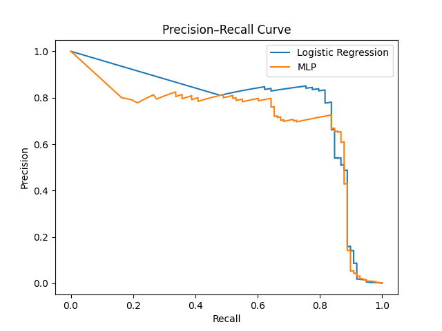
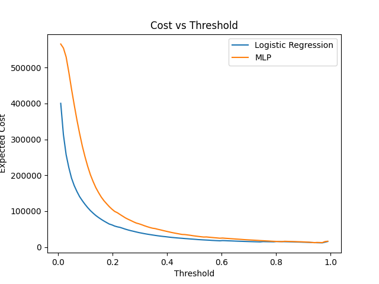

# Nukefraud — Phase 2: Deep Learning Extension

## Introduction

Phase 2 extends the Nukefraud system by introducing a deep learning model based on a Multi-Layer Perceptron (MLP) implemented in PyTorch. The objective is to evaluate whether increased model capacity improves fraud detection performance under extreme class imbalance and cost-sensitive decision constraints.

Phase 1 established a strong logistic regression baseline with cost-based threshold optimization and achieved competitive PR-AUC and business cost performance. Phase 2 preserves the same evaluation protocol, threshold optimization procedure, and cost model to ensure controlled empirical comparison.

All experiments were conducted using the Kaggle Credit Card Fraud dataset (284,807 transactions; 492 fraud cases, ~0.17% positive rate).

---

## Objectives

The goals of Phase 2 are:

1. Implement a deep MLP architecture using PyTorch.
2. Properly handle class imbalance via weighted binary cross-entropy.
3. Introduce mini-batch training and early stopping.
4. Maintain cost-based threshold optimization identical to Phase 1.
5. Compare deep learning performance against the logistic regression baseline under identical evaluation metrics.
6. Assess whether increased model complexity translates to improved business outcomes.

---

## Theoretical Foundations

### Logistic Regression vs Neural Networks in Tabular Data

Logistic regression models:

$$
P(y=1 \mid x) = \sigma(w^T x)
$$

where $\sigma$ is the sigmoid function.

It is a linear decision boundary model. For PCA-transformed tabular data (as in the Kaggle dataset), features are orthogonal and standardized, often favoring linear models.

Neural networks introduce non-linear transformations:

$$
h_1 = \phi(W_1 x + b_1)
$$
$$
h_2 = \phi(W_2 h_1 + b_2)
$$
$$
\hat{y} = W_3 h_2 + b_3
$$

where $\phi$ is a non-linear activation (ReLU). Increased depth enables modeling of higher-order interactions but also increases variance and overfitting risk.

In structured tabular problems, deep learning does not consistently outperform well-regularized linear or tree-based models.

---

### BCEWithLogitsLoss

The MLP uses `BCEWithLogitsLoss`, which combines a sigmoid layer and binary cross-entropy in a numerically stable formulation:

$$
\mathcal{L} = - \left[ y \log(\sigma(z)) + (1 - y)\log(1 - \sigma(z)) \right]
$$

This avoids numerical instability compared to applying sigmoid separately.

---

### Derivation of `pos_weight`

Given:

* $N_+$ = number of positive samples
* $N_-$ = number of negative samples

Class imbalance is handled via:

$$
\mathrm{pos\_weight} = \frac{N_-}{N_+}
$$

The weighted loss becomes:

$$ \mathcal{L} = -\left[ \mathrm{pos\_weight}\, y \log(\sigma(z)) + (1-y)\log(1-\sigma(z)) \right] $$

Where:<br>
$$ \mathrm{pos\_weight} = \frac{N_-}{N_+} $$
and in implementation this corresponds to `pos_weight` in `BCEWithLogitsLoss`.

This increases gradient magnitude for fraud samples, counteracting extreme imbalance.

---

### ROC-AUC vs PR-AUC

**ROC-AUC** measures ranking performance across all classification thresholds. It evaluates the tradeoff between true positive rate and false positive rate.

**PR-AUC** measures precision vs recall:

$$
\text{Precision} = \frac{TP}{TP + FP}
$$
$$
\text{Recall} = \frac{TP}{TP + FN}
$$

Under heavy class imbalance:

* ROC-AUC can remain high even with many false positives.
* PR-AUC penalizes false positives more directly.

Given a fraud rate of ~0.17%, PR-AUC is more informative for operational performance.

---

## Project Architecture

### Additional Files

New modules introduced in Phase 2:

```text
src/models/mlp.py
src/models/mlp_trainer.py
src/analysis/compare_models.py
```

### Updated Folder Structure

```text
nukefraud/
│
├── src/
│   ├── models/
│   │   ├── baseline.py
│   │   ├── trainer.py
│   │   ├── mlp.py
│   │   └── mlp_trainer.py
│   │
│   ├── analysis/
│   │   └── compare_models.py
│   │
│   ├── evaluation.py
│   ├── thresholding.py
│   └── config.py
│
├── models/
│   ├── logistic_model.pkl
│   └── mlp_model.pt
│
├── results/
│   └── figures/
│       ├── pr_curve_comparison.png
│       └── cost_vs_threshold.png
```

---

### MLP Module

Architecture:

* Input → Linear(128)
* BatchNorm
* ReLU
* Dropout(0.3)
* Linear(64)
* BatchNorm
* ReLU
* Dropout(0.3)
* Linear(1)

The output layer produces logits (no sigmoid applied inside the model).

---

### Training Loop

Training pipeline:

* 80/20 train-validation split
* Mini-batch training (batch size = 1024)
* Adam optimizer
* Weighted BCE loss
* Validation PR-AUC monitoring

---

### Early Stopping Logic

Early stopping criteria:

* Monitor validation PR-AUC
* Patience = 5 epochs
* Stop if no improvement for 5 consecutive epochs
* Restore best model weights

This prevents overfitting while preserving the strongest checkpoint.

---

### Checkpointing and Artifact Saving

* Best model saved as `mlp_model.pt`
* Logistic model retained for comparison
* Threshold optimization performed post-training
* Final threshold stored alongside model metadata

All artifacts are production-ready for API deployment.

---

## Installation

Clone repository and set up environment:

```bash
git clone <repo_url>
cd nukefraud
python3 -m venv venv
source venv/bin/activate
pip install -r requirements.txt
```

Ensure PyTorch is installed with compatible CUDA/CPU configuration.

---

## Usage

### Train MLP Model

```bash
python -m src.models.mlp_trainer
```

This:

* Trains MLP with early stopping
* Saves best checkpoint
* Performs cost-based threshold optimization

### Compare Models

```bash
python -m src.analysis.compare_models
```

Outputs ROC-AUC, PR-AUC, optimized precision, recall, expected cost for both models, and generates comparison figures.

---

## Results

### Logistic Regression (Optimized)

* ROC-AUC ≈ 0.972
* PR-AUC ≈ 0.719
* Fraud Precision ≈ 0.48
* Fraud Recall ≈ 0.89
* Expected Cost ≈ 11,950

The logistic model maintains strong ranking and superior precision in the high-recall region.

---

### Deep MLP (Optimized)

* ROC-AUC ≈ 0.979
* PR-AUC ≈ 0.687
* Fraud Precision ≈ 0.38
* Fraud Recall ≈ 0.89
* Expected Cost ≈ 12,410

The MLP improved ROC-AUC but reduced PR-AUC and increased expected cost.

---

### Comparative Analysis

The MLP achieved higher ROC-AUC, indicating improved global ranking ability. However, PR-AUC decreased, meaning the model generated more false positives at relevant recall levels.

Key observations:

* Logistic regression dominates in the high-precision region.
* MLP may slightly dominate in the mid-recall region.
* Logistic achieves lower minimum business cost.
* Increased capacity did not translate into better cost-sensitive performance.
* PCA-transformed features may reduce benefits of deep non-linear modeling.
* The dataset size (~492 positive cases) limits effective deep model generalization.

Interpretation:

The MLP learned slightly better global separation but failed to improve precision where operational thresholds operate. In fraud detection, local ranking quality in the high-recall regime is more important than marginal improvements in global ranking metrics.

---

## Precision–Recall Curve Analysis

The PR curve comparison is shown below:



Observations:

* Logistic regression dominates in the high-precision region.
* MLP may slightly dominate in the mid-recall region.
* At recall levels above ~0.85, logistic maintains more stable precision.
* The area under the PR curve is higher for logistic regression.

PR curves reveal model behavior under class imbalance more transparently than ROC curves. For fraud detection, the high-recall region is operationally critical, making logistic regression preferable under the current cost structure.

---

## Cost vs Threshold Analysis

The cost vs threshold curve is shown below:



Where:

$$
\text{Cost} = 1000 \cdot FN + 10 \cdot FP
$$

Observations:

* Logistic regression achieves a lower minimum cost.
* MLP curve flattens differently across thresholds.
* The optimal threshold differs but does not reverse cost ranking.
* Logistic demonstrates sharper cost minimization behavior.

These curves confirm that better ROC performance does not guarantee lower expected business loss.

---

## Discussion

### Why Deep Learning Did Not Outperform

1. PCA-transformed features are already close to linearly separable.
2. Limited positive samples restrict deep model generalization.
3. Tabular fraud data often favors simpler or tree-based models.
4. Added capacity increases variance without proportional bias reduction.

### When MLP Might Outperform

* Larger datasets with richer raw features.
* Non-linear feature interactions not captured by PCA.
* Feature embeddings for categorical metadata.
* Concept drift scenarios requiring adaptive modeling.

### Importance of Empirical Validation

Model selection must be driven by operational metrics. Improvements in ROC-AUC alone are insufficient when decision-making is cost-sensitive.

### Complexity Is Not Automatically Superior

This phase reinforces that architectural sophistication does not guarantee improved business outcomes in imbalanced tabular problems.

---

## Key Takeaways

1. ROC-AUC improvements do not imply PR-AUC improvements.
2. PR-AUC is more aligned with operational fraud detection performance.
3. Weighted BCE stabilizes training under extreme imbalance.
4. Logistic regression remains highly competitive on structured tabular data.
5. Business cost modeling is essential for fair model comparison.

---

## Future Development

* Hyperparameter search (depth, width, dropout, learning rate)
* K-fold cross-validation
* Probability calibration (Platt scaling, isotonic regression)
* Ensemble learning
* XGBoost comparison
* FastAPI inference endpoint
* Streamlit monitoring interface
* Docker containerization
* Cloud deployment

---

## Appendices

### Debugging Issues

* Gradient instability when batch normalization used with small batch sizes.
* Early stopping triggered prematurely due to noisy PR-AUC fluctuations.

### Overfitting Signs

* Training loss decreased steadily while validation PR-AUC plateaued.
* Increased variance across random seeds.

### Environment Challenges

* PyTorch CPU/GPU mismatch.
* Reproducibility affected by random seed initialization.
* Version conflicts between PyTorch and CUDA runtime.

### Model Checkpoint Handling

* Ensured best validation checkpoint restored before threshold optimization.
* Verified consistent artifact serialization for deployment compatibility.
* Confirmed deterministic evaluation before model comparison.

---
